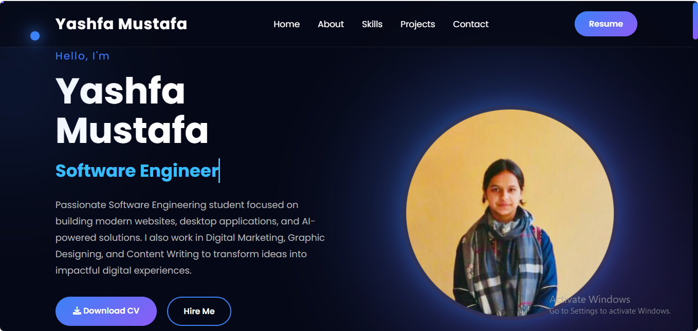

# 🌐 Yashfa Mustafa | Personal Portfolio Website

A modern, responsive personal portfolio website showcasing my journey as a **Software Engineering student**, web developer, Java developer, graphic designer, and digital marketer. Built from scratch using HTML5, CSS3, and JavaScript, this site highlights my projects, skills, and experience.

🔗 **Live Demo:** [ https://yashfamustafa.github.io/professional-portfolio/](#) &nbsp;•&nbsp; 📄 **Resume:** [Download](./resume.pdf)



---

## ✨ Features

- 🎯 **Dynamic Typing Effect** — animated role titles on the hero section
- 📱 **Fully Responsive Design** — optimized for desktop, tablet, and mobile
- 🌀 **Scroll Reveal Animations** — smooth fade-in effects as you scroll
- 🔢 **Animated Counters** — statistics that count up on scroll into view
- 📊 **Skill Progress Bars** — animated proficiency indicators
- 🖱️ **Custom Cursor Glow & Parallax Effects** — subtle interactive touches
- 🎈 **Floating Card Animations** — for services, projects, and skill cards
- 📌 **Sticky Navbar with Active Link Highlighting**
- ⬆️ **Back-to-Top Button** and **Scroll Progress Indicator**
- 💌 **Contact Form with Client-Side Validation**
- ✅ **Filterable Project Gallery**

---

## 🗂️ Pages

| Page | Description |
|------|--------------|
| `index.html` | Home — hero introduction, services, featured projects, and stats |
| `about.html` | About — bio, education timeline, and achievements |
| `skills.html` | Skills — technical, creative, and Microsoft Office proficiencies |
| `projects.html` | Projects — detailed showcase of all major and practice projects |
| `contact.html` | Contact — contact form, details, and social links |

---

## 🛠️ Built With

- **HTML5** — semantic page structure
- **CSS3** — custom styling, responsive layouts, and animations
- **JavaScript (Vanilla)** — interactivity, DOM manipulation, and scroll effects
- **[Font Awesome](https://fontawesome.com/)** — icon library
- **[Google Fonts (Poppins)](https://fonts.google.com/)** — typography

---

## 📁 Project Structure

```
portfolio/
├── index.html          # Home page
├── about.html          # About page
├── skills.html          # Skills page
├── projects.html        # Projects page
├── contact.html          # Contact page
├── style.css            # Main stylesheet
├── style1.css            # Additional styles
├── script.js             # JavaScript functionality
├── resume.pdf             # Downloadable resume
├── profile.jpeg          # Profile image
├── about.jpeg            # About page image
├── ambulance.png         # Project screenshot
├── chatbot.png           # Project screenshot
├── odhoachar.png          # Project screenshot
├── portfolio.png          # Project screenshot
└── README.md              # Project documentation
```

---

## 🚀 Getting Started

1. **Clone the repository**
   ```bash
   git clone https://github.com/yashfamustafa/portfolio.git
   ```
2. **Navigate to the project folder**
   ```bash
   cd portfolio
   ```
3. **Open `index.html`** in your browser — no build tools or dependencies required.

---

## 💼 Featured Projects

### 🚑 Ambulance Management System
A complete desktop application built with **Java Swing** and **MySQL**, managing patient records, ambulance records, medical history, and emergency response with full database integration.

### 🤖 AI Restaurant Chatbot
A **C++** based chatbot capable of answering restaurant-related customer queries, displaying menus, and recommending dishes.

### 🛒 Odho's — Taste of Tradition
A responsive **e-commerce website** promoting authentic, handcrafted Sindhi pickle products, built with HTML, CSS, and JavaScript.

### 🌐 Personal Portfolio
This very website — a modern, animated, and responsive portfolio built with HTML5, CSS3, and JavaScript.

---

## 🧑‍💻 Skills Overview

**Programming:** HTML5 · CSS3 · JavaScript · Java · C++ · PHP · SQL
**Creative & Professional:** Graphic Designing · Digital Marketing · Content Writing · Problem Solving
**Tools:** Git & GitHub · VS Code · IntelliJ IDEA · MySQL · NetBeans · Figma · Canva

---

## 📬 Contact Me

- 📧 **Email:** [yashfamustafa04@gmail.com](mailto:yashfamustafa04@gmail.com)
- 📞 **Phone:** +92 329 3240452
- 📍 **Location:** Sukkur, Pakistan
- 💻 **GitHub:** [github.com/yashfamustafa](https://github.com/yashfamustafa)
- 🔗 **LinkedIn:** [linkedin.com/in/yashfa-mustafa](https://www.linkedin.com/in/yashfa-mustafa-2963463a3)

---

## 📄 License

This project is open source and available for personal reference. Please avoid direct copying of design/content for your own portfolio — feel free to draw inspiration instead! 🙂

---

<p align="center">Made with ❤️ by <strong>Yashfa Mustafa</strong></p>
